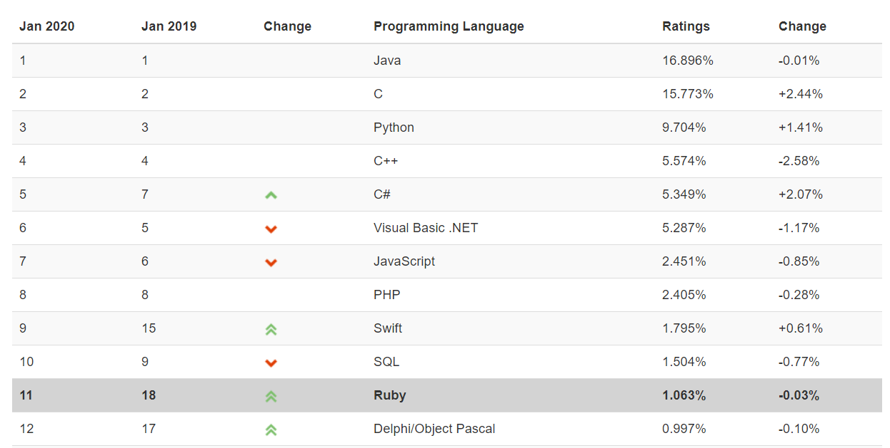

## 作者

Python的创始人为荷兰人吉多·范罗苏姆 [3]  （Guido van Rossum）。1989年圣诞节期间，在阿姆斯特丹，Guido为了打发圣诞节的无趣，决心开发一个新的脚本解释程序，作为ABC 语言的一种继承。之所以选中Python（大蟒蛇的意思）作为该编程语言的名字，是取自英国20世纪70年代首播的电视喜剧《蒙提.派森的飞行马戏团》（Monty Python's Flying Circus）

* 也許牛逼的人就是這樣，工作上打醬油，也做不出什麼樣的成績，但是業餘時間搗鼓的東西卻影響了世界

## 語言排名

- 目前是暫列第三位

## 版本說明

- python一直存在兩個版本，一個是python2 一個是python3，python2有時代包袱，已經很多內庫不再支持，本教程是使用最新版本的python3，進行教學開發

