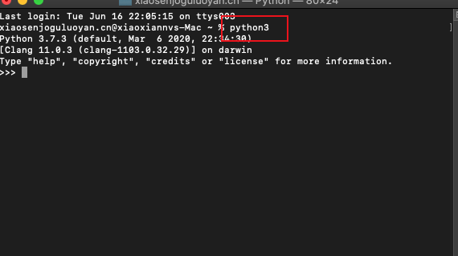

## 環境安裝
[下載地址](https://www.python.org/downloads/)

1. windows
- windows的安裝比較簡單，直接下一步既可以，記得勾選add to Path（配置環境變量）

2. linux 

- linux比如說ubuntu等系統都自帶有python



3. macOS

- unix系統也自帶有python,和linux 一樣輸入python3既可

如果沒有可以使用在cmd line里可以通過

```
brew install python 
```
進行安裝